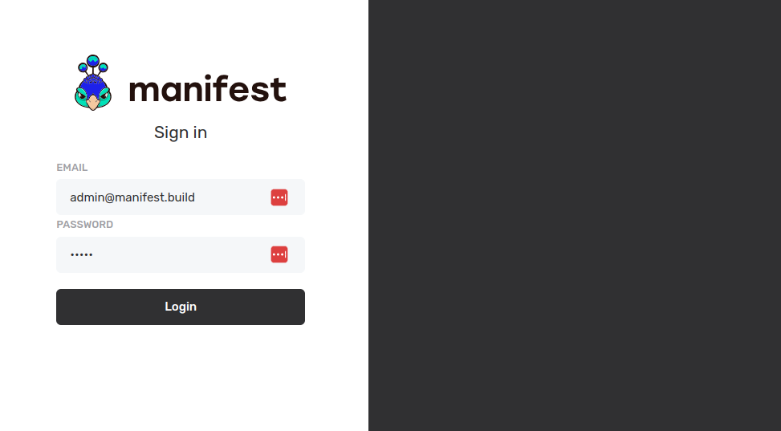

# Manifest + Astro: Making the Starter Blog Template Dynamic

This repository enhances the default **Astro starter blog template** adding a [Manifest backend](https://github.com/mnfst/manifest) to it. Instead of getting the blog post from a static "content" folder, we use Manifest JS SDK to fetch dynamically the data.

[](https://stackblitz.com/github/brunobuddy/demo-astro-manifest)
[](https://codesandbox.io/p/sandbox/github/brunobuddy/demo-astro-manifest)
[](https://codespaces.new/brunobuddy/demo-astro-manifest?devcontainer_path=.devcontainer/blog/devcontainer.json)


Features:

- ✅ Minimal styling (make it your own!)
- ✅ 100/100 Lighthouse performance
- ✅ SEO-friendly with canonical URLs and OpenGraph data
- ✅ Sitemap support
- ✅ RSS Feed support
- ✅ Markdown & MDX support

🦚 New features:

- 🔥 Admin panel
- 🔥 Dynamic resources
- 🔥 SQLite database

## 🚀 Project Structure

Inside of your Astro project, you'll see the following folders and files:

```text
├── public/
├── src/
│   ├── components/
│   ├── content/
│   ├── layouts/
│   └── pages/
├── manifest/
│   ├── backend.db
│   ├── backend.yml
├── astro.config.mjs
├── README.md
├── package.json
└── tsconfig.json
```

## 🧞 Commands

All commands are run from the root of the project, from a terminal:

| Command                   | Action                                           |
| :------------------------ | :----------------------------------------------- |
| `npm install`             | Installs dependencies                            |
| `npm run dev`             | Starts local dev server at `localhost:4321`      |
| `npm run build`           | Build your production site to `./dist/`          |
| `npm run preview`         | Preview your build locally, before deploying     |
| `npm run astro ...`       | Run CLI commands like `astro add`, `astro check` |
| `npm run astro -- --help` | Get help using the Astro CLI                     |

## 👀 Want to learn more?



**[Manifest](https://github.com/mnfst/manifest) is a whole backend that fits into a single YAML file**. It is a simple way to turn any frontend dynamic with minimal config and skill set. The project is in BETA, if you want to follow the project, [give us a ⭐ on Github !](https://github.com/mnfst/manifest)

The current backend for the blog template is generated by this YAML file only:

```yaml
# manifest/backend.yml
name: Astro blog
entities:
  Post:
    properties:
      - title
      - description
      - { name: pubDate, type: date }
      - { name: updatedDate, type: date }
      - {
          name: heroImage,
          type: image,
          options:
            {
              sizes:
                {
                  small: { width: 320, height: 240 },
                  large: { width: 960, height: 480 },
                },
            },
        }
```

## Credit

This theme is based off of the lovely [Bear Blog](https://github.com/HermanMartinus/bearblog/).
